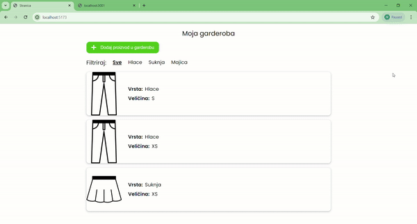

# React Wardrobe App



[Video of how it works](https://drive.google.com/file/d/1I0I5QOKdlYIiRYY7QCRqmccdWBYNdrTz/view?usp=sharing)

This project is a simple and responsive Wardrobe App built with React.js and TypeScript. It features a single-page design with extensive functionality, including filtering items, adding, deleting, and editing wardrobe items.

## Summary

For this project, I utilized a React template that I created, incorporating a well-organized SCSS structure where each component has its folder.

**Design and Styling**

I defined typography and the main font which is [Poppins](https://fonts.google.com/specimen/Poppins?query=poppins) from [Google fonts](https://fonts.google.com/).

**TypeScript Integration**

I created TypeScript types for the data I got from the JSON server and used them in the components.

**CRUD Operations**
- **GET** - method for get data from JSON Server (getWardrobeItemById, getWardrobes, getWardrobesType)    
- **POST** - method for create data on JSON Server (makeWardrobeItem)
- **PATCH** - method for edit data on JSON Server (editWardrobeItem)
- **DELETE** - method for delete data from JSON Server (deleteWardrobeItem)

**Challenges and Solutions**

The most challenging part of the project was mastering CRUD operations and implementing a reliable form component with validation. I dedicated time to thoroughly researching how to integrate CRUD operations and connect them with [JSON Server](https://www.npmjs.com/package/json-server). I'm proud of the form component, which effectively minimizes re-renders, and incorporates [Zod](https://zod.dev/) schemas for validation. The form component was designed to be straightforward and well-organized. 

## Project Structure
- **Folders and Files:** The project follows modular structure for folder with components, pages and utilities
- **Technologies Used:** React.js, SCSS, TypeScript
- **CRUD operations:** Four basic operations(Create, Read, Update, Delete)
- **JSON Server:** Server where your data is stored and simulates the backend environment
- **React Hook Form:** Remove unnecessary re-renders and validate forms 
- **Zod:** TypeScript validation schema
- **Considerations:** Through researching re-rendering and validation techniques, I discover various tools to optimize performance and minimize unnecessary re-renders. This project focuses on developing reusable, high-performance components

## Time Spent

I need 30-35 hours of work to make this project.
## How to Use

Make sure you have the following installed on your computer:

- [git](https://git-scm.com/)
- [node.js](https://nodejs.org/en)
- [npm](https://www.npmjs.com/)
- [json-server](https://www.npmjs.com/package/json-server)
- [react-hook-form](https://react-hook-form.com/)
- [zod](https://zod.dev/)

Clone the repository

```bash
git clone https://github.com/Roko03/react-wardrobe.git
cd react-wardrobe
```

Installation

```bash
npm i
#or
npm install
```

Running the Server

```bash
json-server --watch wardrobes.json --port 3001
```

Running the Project

```bash
npm run dev
```

Open [http://localhost:3000](http://localhost:3000) to view the project
